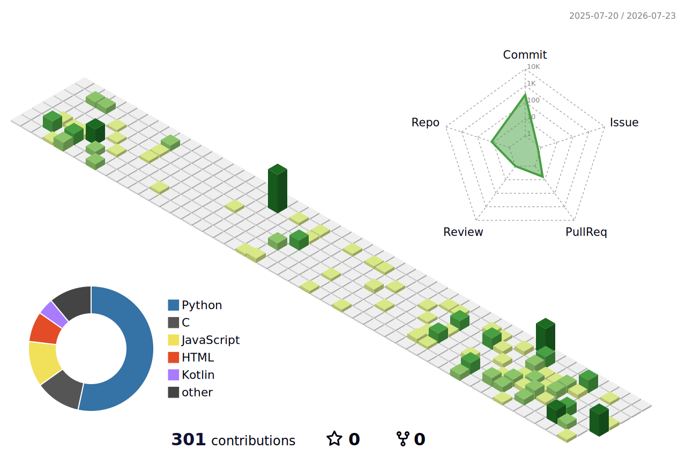

<h1 align="center">Hi there, I'm Chetan! 👋</h1>

  

<h1 align="center">Hi there, I'm Chetan! 👋</h1>

  

  I build machines that see, think, and move. My work spans the full stack of intelligent hardware — from PCB-level electronics and motor control, up through <b>training custom ML models</b> and deploying them on edge accelerators, to the React UIs humans use to command it all.

---

### 👨‍💻 About Me

* 🤖 **Current Focus:** Autonomous robotic systems on the **ROS2 Jazzy** stack, with **AI-powered perception** running on-board in real time.
* 🧠 **AI & ML:** I train **custom YOLO detection/segmentation models** end-to-end — dataset collection & annotation, PyTorch training, INT8 quantization, and deployment on edge accelerators (**Hailo-8 on Raspberry Pi 5**) and microcontrollers (**TensorFlow Lite Micro on ESP32**).
* ⚙️ **Hardware Mastery:** Deeply involved with the **ARM Cortex-M/A ecosystem** — STM32 MCUs (F407, H753ZI, G431KB, G474RE), **NXP i.MX8MQ** application processors, embedded Linux, and RTOS.
* 🛠️ **Systems Engineering:** Differential drive dynamics, multi-board CAN communication, motor control automation, and safety-first architectures.
* 📍 **Location:** Pune, India.

---

### 🧰 Tech Stack & Tools

  
<b>🧠 AI, ML & Computer Vision</b>

   
  
  
  
  
  
  
  

  
<b>🤖 Robotics & Embedded Systems</b>

   
  
  
  
  
  
  
  
  

  
<b>💻 Frontend & Web UI</b>

   
  
  
  
  

  
<b>📐 Hardware & Protocols</b>

   
  
  
   Prototype --> Production" />

---

### 🚀 Featured Engineering Projects

  
<b>🧠 Edge-AI Vision Pipeline for Field Robotics</b>

  <ul>
    <li><b>Full ML lifecycle, owned end-to-end:</b> field data collection → annotation → training custom <b>YOLOv8 segmentation models</b> (PyTorch/Ultralytics) → <b>INT8 quantization</b> → compilation for the <b>Hailo-8 accelerator</b> on Raspberry Pi 5.</li>
    <li>Fused <b>classical CV pre-filters</b> (Excess Green vegetation index) with deep-learning inference to slash false positives and cut compute load — real-time perception on a battery-powered outdoor robot.</li>
    <li>Camera stack tuned for harsh outdoor lighting; model performance validated against safety-critical false-positive budgets before actuation is ever allowed.</li>
  </ul>

  
<b>📟 TinyML — Machine Learning on Microcontrollers</b>

  <ul>
    <li>Deployed <b>TensorFlow Lite Micro</b> CNN inference directly on <b>ESP32-CAM</b>: on-device camera-based digit recognition for retrofit smart metering — capture, inference, and LTE backhaul all running on a coin-sized board.</li>
    <li>Built a 6-node <b>ESP-NOW mesh</b> real-time sensor network (MPU-6500 IMUs + capacitive touch) — low-latency multi-node coordination without Wi-Fi infrastructure.</li>
  </ul>

  
<b>🦾 Autonomous 1-Ton Industrial Platforms</b>

  <ul>
    <li><b>Heavy-Duty 4-Wheel Rover:</b> Engineered steering and locomotion specs for a 1-ton load capacity rover platform. The architecture uses hub motors for primary driving and digital servo motors (1:10 gear ratio) for precise turning and swivel motion of the 22-inch wheel assemblies.</li>
    <li><b>Differential-Drive Forklift:</b> Designed physical torque requirements and a minimal chassis capable of lifting a 1-ton pallet using a custom hydraulic system.</li>
  </ul>

  
<b>🍽️ Serving Robot Waypoint System</b>

  <ul>
    <li>Developed a full-stack integration utilizing a <b>ROS2 Jazzy backend</b> and a custom <b>React JS frontend</b>.</li>
    <li>Engineered the UI to seamlessly manage waypoint navigation, map localization, and specific serving sequences for a specialized robot workspace.</li>
  </ul>

  
<b>🔌 Multi-Board CAN Communication Bench</b>

  <ul>
    <li>Established a hardware testing environment to validate real-time multi-board communication.</li>
    <li>Successfully integrated and linked <b>NUCLEO-H753ZI</b>, <b>NUCLEO-G431KB</b>, and <b>NUCLEO-G474RE</b> development boards over CAN bus.</li>
  </ul>

---

### 📊 GitHub Analytics

<!-- Stats generated by jstrieb/github-stats Action in Chetan2312/github-stats repo -->

  
  

 

  

 

  

---

### 🏙️ 3D Contribution City

  

---

### 🟡 Pac-Man Contribution Graph

  

---

### 🤝 Connect With Me

  
  

 

  

  I build machines that see, think, and move. My work spans the full stack of intelligent hardware — from PCB-level electronics and motor control, up through <b>training custom ML models</b> and deploying them on edge accelerators, to the React UIs humans use to command it all.

---

### 👨‍💻 About Me

* 🤖 **Current Focus:** Autonomous robotic systems on the **ROS2 Jazzy** stack, with **AI-powered perception** running on-board in real time.
* 🧠 **AI & ML:** I train **custom YOLO detection/segmentation models** end-to-end — dataset collection & annotation, PyTorch training, INT8 quantization, and deployment on edge accelerators (**Hailo-8 on Raspberry Pi 5**) and microcontrollers (**TensorFlow Lite Micro on ESP32**).
* ⚙️ **Hardware Mastery:** Deeply involved with the **ARM Cortex-M/A ecosystem** — STM32 MCUs (F407, H753ZI, G431KB, G474RE), **NXP i.MX8MQ** application processors, embedded Linux, and RTOS.
* 🛠️ **Systems Engineering:** Differential drive dynamics, multi-board CAN communication, motor control automation, and safety-first architectures.
* 📍 **Location:** Pune, India.

---

### 🧰 Tech Stack & Tools

  
<b>🧠 AI, ML & Computer Vision</b>

   
  
  
  
  
  
  
  

  
<b>🤖 Robotics & Embedded Systems</b>

   
  
  
  
  
  
  
  
  

  
<b>💻 Frontend & Web UI</b>

   
  
  
  
  

  
<b>📐 Hardware & Protocols</b>

   
  
  
   Prototype --> Production" />

---

### 🚀 Featured Engineering Projects

  
<b>🧠 Edge-AI Vision Pipeline for Field Robotics</b>

  <ul>
    <li><b>Full ML lifecycle, owned end-to-end:</b> field data collection → annotation → training custom <b>YOLOv8 segmentation models</b> (PyTorch/Ultralytics) → <b>INT8 quantization</b> → compilation for the <b>Hailo-8 accelerator</b> on Raspberry Pi 5.</li>
    <li>Fused <b>classical CV pre-filters</b> (Excess Green vegetation index) with deep-learning inference to slash false positives and cut compute load — real-time perception on a battery-powered outdoor robot.</li>
    <li>Camera stack tuned for harsh outdoor lighting; model performance validated against safety-critical false-positive budgets before actuation is ever allowed.</li>
  </ul>

  
<b>📟 TinyML — Machine Learning on Microcontrollers</b>

  <ul>
    <li>Deployed <b>TensorFlow Lite Micro</b> CNN inference directly on <b>ESP32-CAM</b>: on-device camera-based digit recognition for retrofit smart metering — capture, inference, and LTE backhaul all running on a coin-sized board.</li>
    <li>Built a 6-node <b>ESP-NOW mesh</b> real-time sensor network (MPU-6500 IMUs + capacitive touch) — low-latency multi-node coordination without Wi-Fi infrastructure.</li>
  </ul>

  
<b>🦾 Autonomous 1-Ton Industrial Platforms</b>

  <ul>
    <li><b>Heavy-Duty 4-Wheel Rover:</b> Engineered steering and locomotion specs for a 1-ton load capacity rover platform. The architecture uses hub motors for primary driving and digital servo motors (1:10 gear ratio) for precise turning and swivel motion of the 22-inch wheel assemblies.</li>
    <li><b>Differential-Drive Forklift:</b> Designed physical torque requirements and a minimal chassis capable of lifting a 1-ton pallet using a custom hydraulic system.</li>
  </ul>

  
<b>🍽️ Serving Robot Waypoint System</b>

  <ul>
    <li>Developed a full-stack integration utilizing a <b>ROS2 Jazzy backend</b> and a custom <b>React JS frontend</b>.</li>
    <li>Engineered the UI to seamlessly manage waypoint navigation, map localization, and specific serving sequences for a specialized robot workspace.</li>
  </ul>

  
<b>🔌 Multi-Board CAN Communication Bench</b>

  <ul>
    <li>Established a hardware testing environment to validate real-time multi-board communication.</li>
    <li>Successfully integrated and linked <b>NUCLEO-H753ZI</b>, <b>NUCLEO-G431KB</b>, and <b>NUCLEO-G474RE</b> development boards over CAN bus.</li>
  </ul>

---

### 📊 GitHub Analytics

<!-- Stats generated by jstrieb/github-stats Action in Chetan2312/github-stats repo -->

  
  

 

  

 

  

---

### 🐍 Contribution Snake

  

---

### 🤝 Connect With Me

  
  
  

 

  

